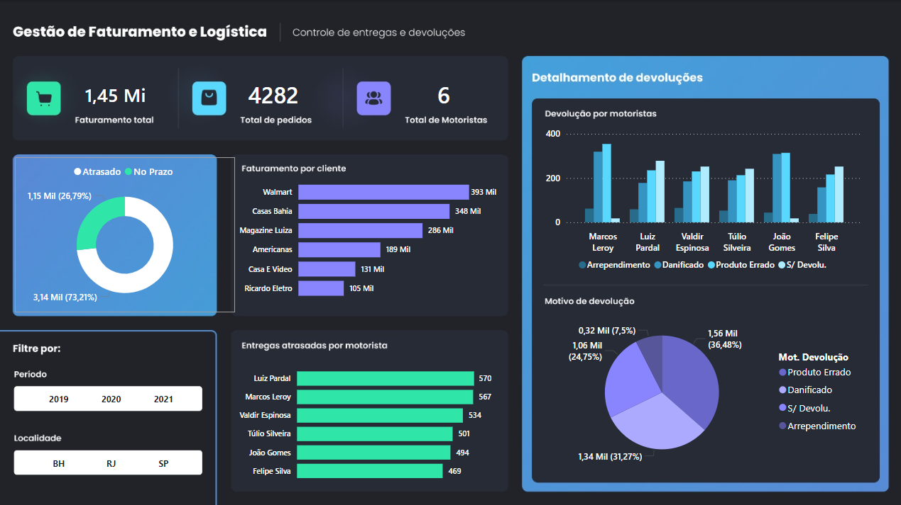

# Aula 06

### Finalização

# Atividade 01

Desenvolver um Dashboard utilizando a planilha **BD_logistica**, faça uma analise das informações e crie uma dashboard utilizando as informações como na imagem

## checklist

 - Fazer uma análise de Dados
 - Verificar se todas as colunas estão divididas
 - Verificar se os valores das colunas estão de forma correta
 - Aplicar a imagem de fundo no dashboard e toda as configurações de Cores

 
## Atividade 02

| Contextualização                                                                                                                                                              |
| ----------------------------------------------------------------------------------------------------------------------------------------------------------------------------- |
| Realizar a Dashboard de uma loja chamada ChocoFino, para controle de vendas nas localidades da loja

| Desafio                                                                                                                      |
| ---------------------------------------------------------------------------------------------------------------------------- |
| Importe os dados do arquivo **Base_vendas.xlsx**                                                            
| Transforme os dados com Power Query                                                                                          
| Faça os relacionamento de tabelas 
| O template da dashboard é o arquivo **Background.jpg**

## **Fómulas**

| **Tabela**   | **Nome**  |**Fórmula**       |
|--------------|-----------|------------------|
| Lojas    | Preço Medio pro Venda  | DIVIDE([Receita],[Qtd Vendida])                                                          
| Lojas    | Receita |SUM(Vendas[Valor Total])                                                                                 
| Vendas   | Qtd Vendida |SUM(Vendas[Quantidade])

| Entregas:                                                            |
| -------------------------------------------------------------------- |
| Apresente ao professor o arquivo com as análises solicitadas. 
| Enviar atividades no link: https://forms.gle/VsM1XpDtd2sLYSX69 

#
